<!-- Add more links by copying this line, for example:

-->

 

Hello! I'm <b>Keydstunna</b>, a third-year <b>BS Information Technology</b> student.
I enjoy learning new technologies, building web projects, and solving problems through code.
  
Right now I'm sharpening my skills in <b>PHP, JavaScript, HTML, and CSS</b>,
and working toward becoming a well-rounded developer.

 

Third-year BSIT student, always building and learning.
 
<i>"you can never be too happy in this life"</i>
  
<b>Building | Learning | Shipping</b>

 

